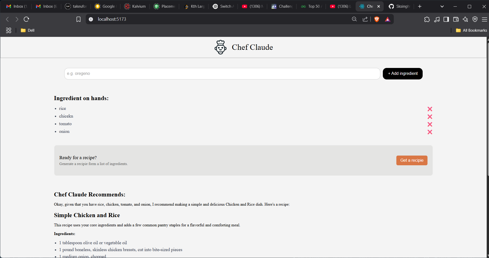

# 👨‍🍳 CHEF-CLAUDE

**Chef-Claude** is your AI-powered kitchen assistant. Just tell it what ingredients you have, and it will suggest a delicious recipe you can make! Whether you're short on ideas or just want to try something new, Chef-Claude has you covered.

---

## 🌟 Features

* 🔍 Enter **at least 4 ingredients** to generate a recipe.
* 🤖 AI-generated recipes using **Google Gemini API**.
* 🧾 Clean markdown-formatted instructions for easy reading.
* ⚡ Built with React and Axios for a fast, responsive experience.

---

## 💠 Tech Stack

* **React** – Frontend UI
* **Axios** – API requests
* **Google Gemini API** – AI recipe generation
* **Vite** – Build tool for lightning-fast development

---

## 🚀 Getting Started

### 1. Clone the repository

```bash
git clone https://github.com/your-username/chef-claude.git
cd chef-claude
```

### 2. Install dependencies

```bash
npm install
```

### 3. Configure environment variables

Create a `.env` file in the root of your project and add your Gemini API configuration:

```env
VITE_GEMINI_API_KEY=your_google_gemini_api_key
VITE_GEMINI_API_URL=https://generativelanguage.googleapis.com/v1beta/models/gemini-pro:generateContent
```

### 4. Run the app

```bash
npm run dev
```

Visit `http://localhost:5173` in your browser.

---

## 🔎 How It Works

1. Users input ingredients (minimum of 4).
2. Ingredients are sent to the Gemini AI model.
3. AI generates a complete recipe using those ingredients, plus a few optional extras.
4. Recipe is displayed in a markdown-rendered view.

---

## 💡 Example

**Input:**

```
eggs, milk, bread, cheese
```

**Output:**

```
## Cheesy Egg Toast

**Ingredients:**
- Eggs
- Milk
- Bread
- Cheese
- Butter
- Salt and pepper

**Instructions:**
1. Beat the eggs with milk, salt, and pepper.
2. Dip bread slices into the egg mixture.
3. Heat butter in a pan and toast the bread on both sides.
4. Sprinkle cheese on top and cover until melted.
5. Serve hot and enjoy!
```

---

## 📸 Screenshots



---

## 🤝 Contributing

Contributions are welcome! Whether it's a bug fix, a feature idea, or UI enhancements — feel free to fork the project and submit a pull request.

---

## 📄 License

MIT License – use it freely for personal or commercial projects.
